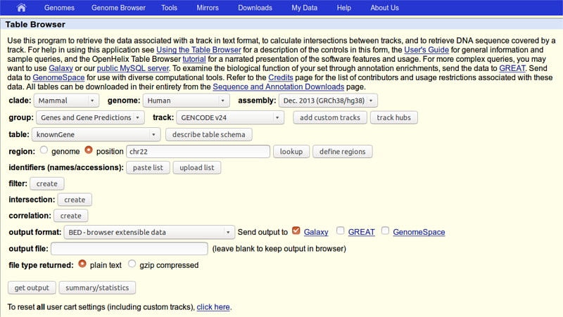
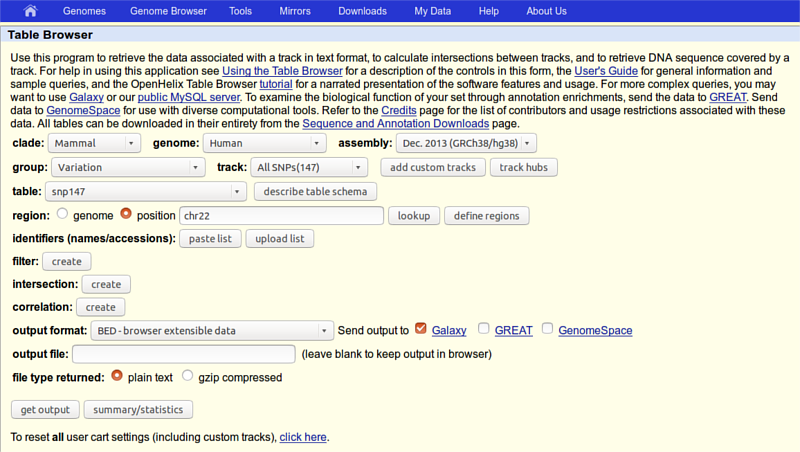

---

layout: default
title: Basic
---

# Background
Suppose you get the following question: 

> "Mom (or Dad) ... Which coding exon has the highest number of single nucleotide polymorphisms on chromosome 22?".  

You think to yourself "_Wow! This is a simple question ... I know exactly where the data is (at UCSC) but how do I actually compute this?_" The truth is, there is really no straightforward way of answering this question in a time frame comparable to the attention span of a 7-year-old. Well ... actually there is and it is called Galaxy. So let's try it...

# Setup 

## Create an account or Log in to the Galaxy server
Connect to [{{ site.galaxy_url }}]({{ site.galaxy_url }}), go to the User link at the top of Galaxy interface and choose:
 
 * **Login**, if you have an account. Enter your credentials and you're in!
 * **Register**, if you don't have yet an account. Put on the "create users" form your email, a password and a public name and then log in.

## How to change password 
From the _**User**_ menu at the top, choose **Preferences** and then **Manage your information** to access the change password form

## Getting coding exons from UCSC 
First thing we will do is to obtain data from UCSC by clicking "**Get Data** -> **UCSC Main table browser**" on the tools column.
You will see UCSC Table Browser interface appearing in your browser window:

Make sure that your settings are exactly the same as shown on the screen, in particular:
 
 * ***region*** you should select **position** and write **chr22** in the corresponding text field 
 * _**output format**_ should be set to **BED - browser extensible data** 
 * in _**Send output to**_ should be checked the option **Galaxy**  
 
Click the _**get output**_ button and you will see the next screen:

here make sure _**Create one BED record per**_ is set to **Coding Exons** and then click **Send query to Galaxy** button.

After this you will see your first History item in Galaxy's right pane.
It will go through grey (preparing) and yellow (running) states to become green.

## Getting SNPs from UCSC 
Now is the time to obtain SNP data. This is done almost exactly the same way. 
First thing we will do is to again click on  "**Get Data** -> **UCSC Main table browser**" tool, but now change:
 
 * _**group**_ to **Variation** 
 * **_track_** to **All SNPs(147)**, 
 * _**region**_ to **position** with **chr22** in the corresponding text field 
 
so that the whole page looks like this:

click the _**get output**_ button  and you should see this:

where you need to make sure that **Whole Gene** is selected ("Whole Gene" here really means "Whole Feature") and click the _**Send query to Galaxy**_ button. You will get your second item in the history.

### Renaming items 
Now we will rename the two history items to **Exons** and **SNPs** by clicking on the Pencil icon adjacent to each item. In the same manner, we will rename history to **Galaxy 101** (or whatever you prefer) by clicking on **Unnamed history**.

## Getting data from a Library 
Some files have been also stored in a data library for you. On the upper panel select _**Shared Data**_ > _**Data Libraries**_", then click on the **Basic** folder and select all the bed files to then import them in the current history.

# Finding the exon with the highest number of SNPs 

## Joining exons with SNPs 
Let's remind ourselves that our objective is to find which exon contains the most SNPs. This first step in answering this question will be joining exons with SNPs. This can be done using _**Operate on Genomics Intervals**_ -> **Join** the intervals of two datasets side-by-side tool.

Make sure your exons are first and SNPs are second and click "Execute". You will get a third history item, take a look at it by clicking on the eye icon adjacent to it:

|chr22 | 16277747  |  16277885  | uc002zlj.1_cds_4_0_chr22_16277748_r | 0  | -  | chr22 |  16277851  |  16277852 |   rs200742649  |   0  |   + |
|chr22 | 16287253  |  16287390  | uc002zlj.1_cds_8_0_chr22_16287254_r | 0  | -  | chr22 |  16287338  |  16287339 |   rs199952431  |   0  |   + |
|chr22 | 16287253  |  16287390  | uc002zlj.1_cds_8_0_chr22_16287254_r | 0  | -  | chr22 |  16287345  |  16287346 |   rs200013113  |   0  |   + |
|chr22 | 16287253  |  16287390  | uc002zlj.1_cds_8_0_chr22_16287254_r | 0  | -  | chr22 |  16287371  |  16287372 |   rs201840700  |   0  |   + |

The first six columns come from the exon dataset, the last six from the SNPs.

## Counting the number of SNPs per exon 
Above we've seen that exon uc002zlj.1_cds_4_0_chr22_16277748_r is repeated four times in the above dataset. Thus we can easily compute the number of SNPs per exon by simply counting the number of repetitions of name for each exon. This can be easily done with the "_**Join, Subtract, and Group**_ -> **Group** data by a column and perform aggregate operation on other columns" tool.

Choose column 4 by selecting **c4** in _**Group by column**_. Then click on **Add new Operation** and make sure the interface looks exactly as shown below:

if you look at the your history you will see that the result of grouping (dataset #4) contains two columns. This first contains the exon name while the second shows the number of times this name has been repeated in dataset #3.

## Sorting exons by SNP count 
To see which exon has the highest number of SNPs we can simply sort the dataset #4 on the second column in descending order. This is done with "_**Filter and Sort**_ -> __Sort__ data in ascending or descending order" tool:

This will generate the fifth history item and you can now see that the highest number of SNPs per exon is 1149.

## Selecting top five 
Now let's select top five exons with the highest number of SNPs.  
For this we will use "_**Text Manipulation**_ -> __Select first__ lines from a dataset" tool:

Clicking **Execute** will produce the sixth history item that will contain just five lines.

## Recovering exon info and displaying data in genome browsers 
Now we know that in this dataset the five top exons contain between 1149 and 720 SNPs. But what else can we learn about these? To know more we need to get back the positional information (coordinates) of these exons. This information was lost at the grouping step and now all we have is just two columns. To get coordinates back we will match the names of exons in dataset #6 (column 1) against names of the exons in the original dataset #1 (column 4). This can be done with "_**Join, Subtract and Group**_ -> __Compare two Datasets__ to find common or distinct rows" tool (note the settings of the tool in the middle pane):

### Displaing at UCSC
The best way to learn about these exons is to look at their genomic surrounding. There is really no better way to do this than using genome browsers. Because this analysis was performed on "standard" human genome, you can directly send your dataset to the **UCSC Genome Browser** by using the _**display at UCSC main**_ link.

# Understanding histories 
In Galaxy your analyses live in histories such as this one on the left. Histories can be very large, you can have as many histories as you want, and all history behavior is controlled by the Options button on the top of the History panel:

## Sharing your Galaxy items with other people 
You can share your Galaxy items--histories, workflows, visualizations, and pages--with other people in two different ways:

 * using email addresses to share with individual users
 * using a web link to share with anyone who knows the link

All sharing is done by selecting 'Share or Publish' from the item's menu; selecting this option takes you to a page where you can enable the share.

## Sharing with Individual Users 
Find the section titled '_Share <Item_type> with Individual Users._' To share with another Galaxy user, click on the button in this section and enter his/her email address. You can share the item with as many users as you want.

## Sharing via Web Link and Publishing an Item 
Find the section titled '_Making <Item_type> Accessible via Link and Publish It._' The buttons in this section enable you to make an item accessible via link and/or publish it. Items accessible via link can be viewed by anyone that knows the link, and you can share an item by giving the link to other people.

Sharing items via link is especially useful if you don't want to require that the person you're sharing with have a Galaxy account or be logged into Galaxy. You can change the text of an item's link by clicking on the pencil next to the link and typing in new text.

When you publish an item, it is made accessible via link (if it not already accessible), and the item is listed in that Galaxy server's published items list. To view the published histories list, click on "_**Shared Data**_ -> _**Published Histories**_". Publishing an item enables others to find your object by browsing or searching the Galaxy server's published items list and is a good way to share your object with the broader Galaxy community and encourage others to use it.

## How to report errors 
If running a tool on the Galaxy server is resulting in an error (the dataset is red), and you can't determine the root cause from the error message or input format checks:

 1. Re-run the job to eliminate transitory cluster issues. Report the problem using the dataset's bug icon. Do not submit an error for the first failure, but leave it undeleted in your history for reference.
 1. Include in the bug report what checks confirmed that data format was not an issue
 1. Anything else you feel is relevant to the error

# Converting histories into workflows 
The history options "Extract workflow" listed above is very special. It allows you to easily convert existing histories into analysis workflows. Why would you want to create a workflows out of a history? To redo the analysis again with minimal clicking.

The center pane will change as shown below and you will be able to choose which steps to include/exclude and how to name the newly created workflow. In this case I named it "**galaxy101**":

once you click Create Workflow you will get the following message: "Workflow 'galaxy101' created from current history". But where did it go? Click on _**Workflow**_ link at the top of Galaxy interface and you will see a list of all workflows with "galaxy101" listed at the top:

# Opening workflow editor 

If you click on a triangle adjacent to the workflow's name you can click **Edit** and the workflow editor will launch. It will allow you to examine and change settings of this workflow as shown below. Note that the box corresponding to the "**Select First**" tool is selected (highlighted with the blue border) and you can see parameters of this tool on the right pane. This is how you can view and change parameters of all tools involved in the workflow.

## Hiding intermediate steps 
Among multiple things you can do with workflows I will just mention one. When workflow is executed one is usually interested in the final product and not in the intermediate steps. These steps can be hidden by mousing over a small asterisk in the lower right corner of every tool box.

## Renaming inputs 
Right now both inputs to the workflow look exactly the same. This is a problem as will be very confusing which input should be exons and which should be SNPs.

The top input dataset (the one with the blue border) connects to the Join tool first, so it must correspond to the exon data. If you click on this box you will be able to rename the dataset in the right pane.

Then click on the second input dataset and rename it "Features" (this would make this workflow a bit more generic, which will be useful later in this tutorial):

## Renaming outputs 
Finally let's rename the workflow's output. For this click on the last dataset ("Compare two Queries") and in the Edit Step Actions dialogue box select "Rename Dataset". Click Create and call it something like "top 5 exons".

## Save! It is important... 
Now let's save the changes we've made by clicking **Options** (top of the center pane) and selecting **Save**.

# Run workflow on another chromosome 

Now that you have a workflow, you can repeat the previous analysis on your chromosome of choice.

## Create a new history 

Before we start let's create a new history by clicking Options and selecting Create New.

## Get Exons and SNPs 

Repeat the steps above but insert a different chromosome in the "position" field, both when getting exons and when getting SNPs.

## Start the Workflow 

At this point you will have two items in your history - one with exons and one with SNPs. Even if the datasets are not green yet, you do not have to wait as Galaxy will automatically start jobs once uploads have ended. So nothing stops us from starting the workflow we have created. First, click on the Workflow link at the top of Galaxy interface, mouse over "galaxy101", and click on the arrow.

Center pane will change to allow you launching the workflow. Select appropriate datasets for Exon and  inputs as shown below, scroll down, and click Run workflow.

Once workflow has started you will initially be able to see all its steps.

Note that because all intermediate steps of the workflow were hidden, once it is finished you will only see the final dataset #7
